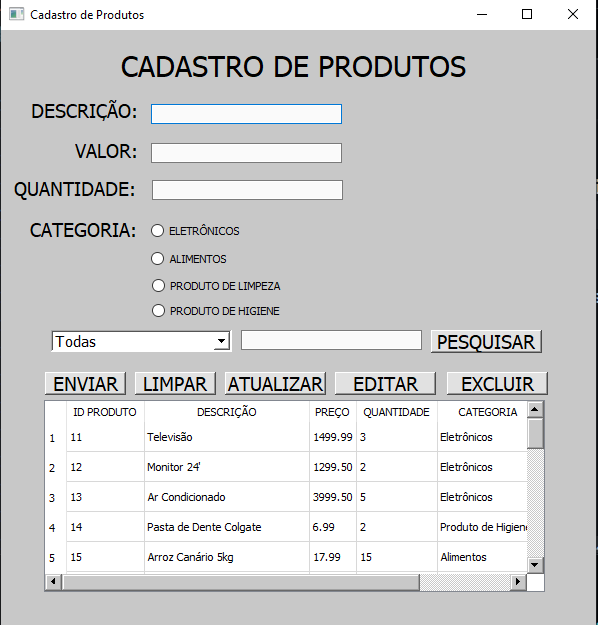
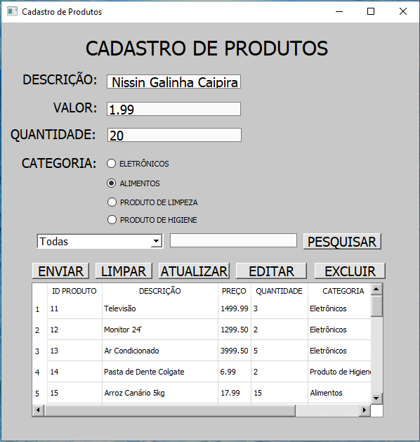
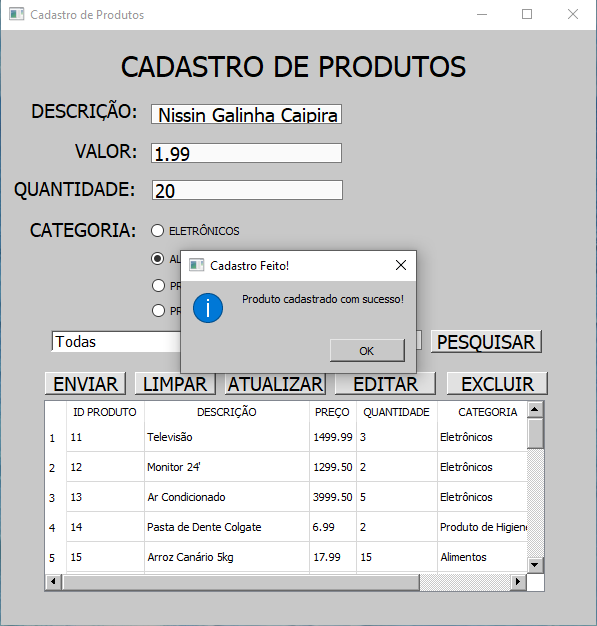
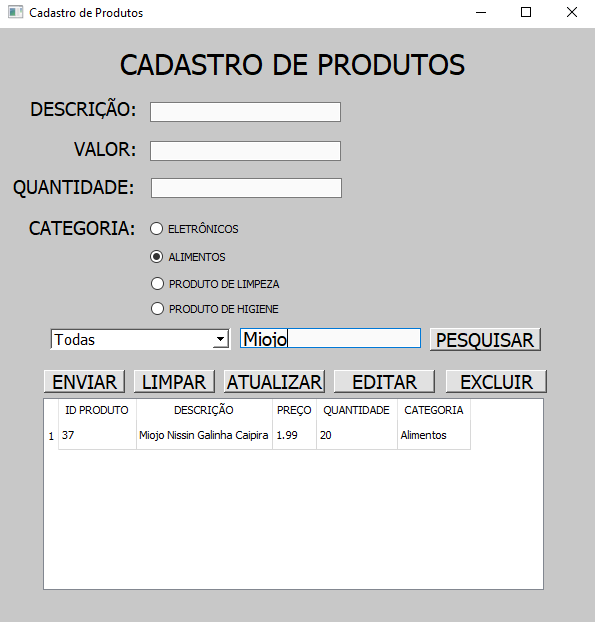
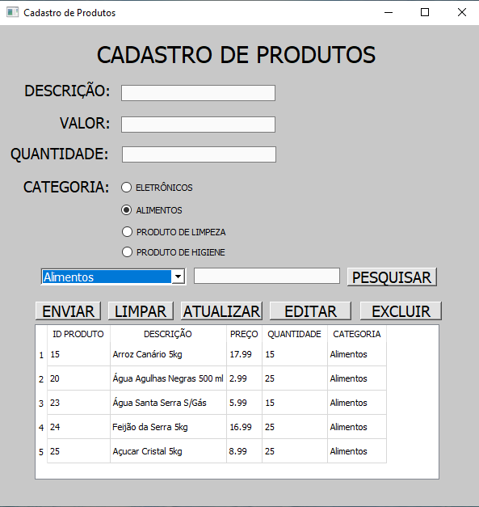
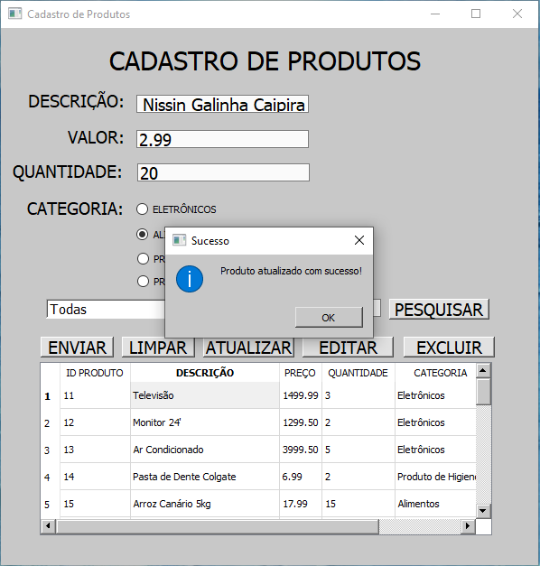
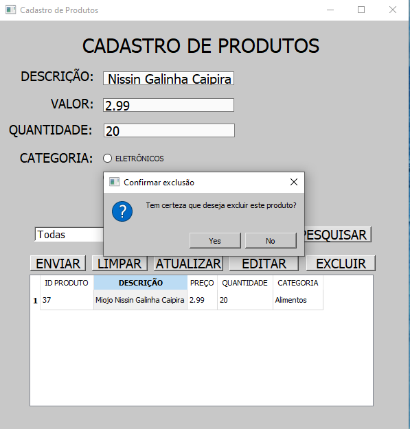

**Sistema de Cadastro de Produtos – Python**

Sistema desktop para **cadastro e gerenciamento de produtos**, desenvolvido em **Python**, com **interface gráfica em PyQt5** e **banco de dados SQL Server**.

Projeto criado com foco em aprendizado prático, organização de código e boas práticas para portfólio na área de **Desenvolvimento de Sistemas**.

---

**Funcionalidades**

- Cadastro de produtos
- Listagem de produtos em tabela
- Atualização de produtos
- Exclusão de produtos com confirmação
- Pesquisa por nome e categoria
- Interface gráfica feita no Qt Designer
- Integração com banco de dados SQL Server
- Arquitetura em camadas (DAO, Service, Database)

**Screenshots**
- Tela Principal do cadastro de produtos.

- Cadastro de Produto

- Pesquisa de um produto

- Pesquisa de um produto por categoria

- Alteração de preço de um produto

- Exemplo exclusão de um produto

---

**Tecnologias Utilizadas**

- Python 3
- PyQt5
- Qt Designer
- SQL Server
- pyodbc
- Git & GitHub

---

**Autora**

**Isabelly Vieira**  
Estudante de Análise e Desenvolvimento de Sistemas  

GitHub: https://github.com/IsabellyVieiraDionizio  
LinkedIn: https://linkedin.com/in/isabelly-vieira-dionizio/

